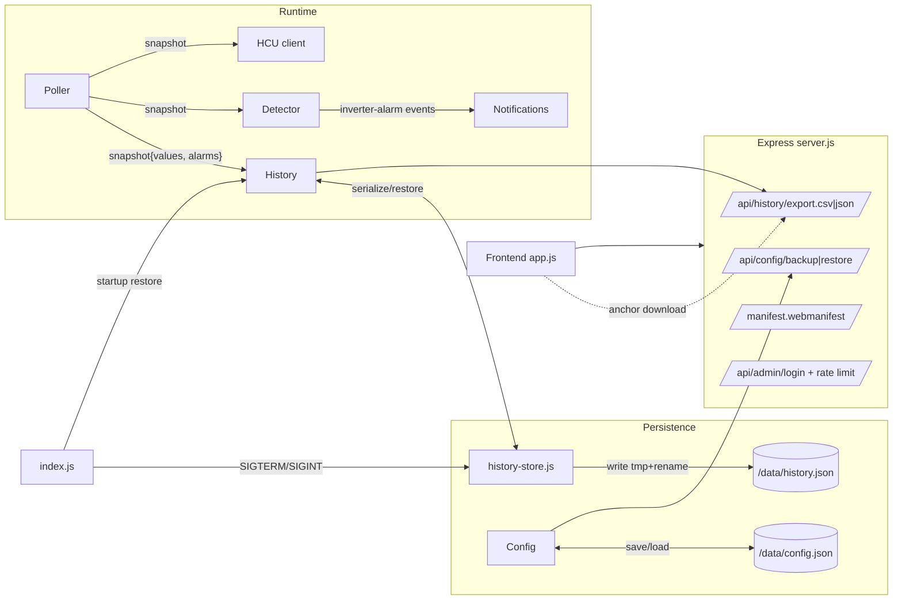
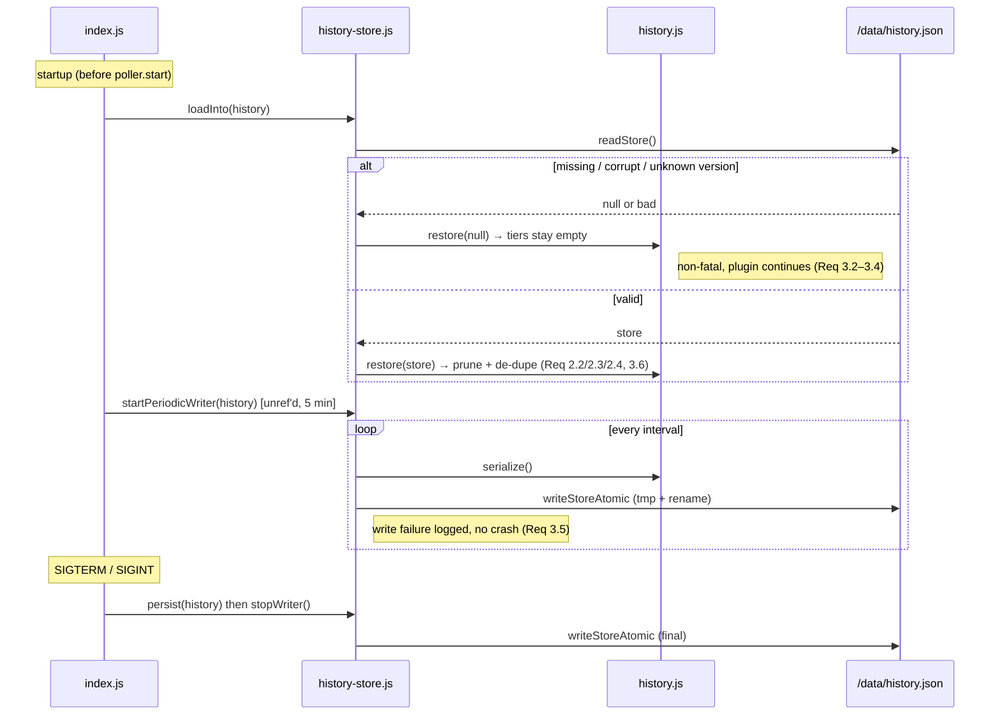
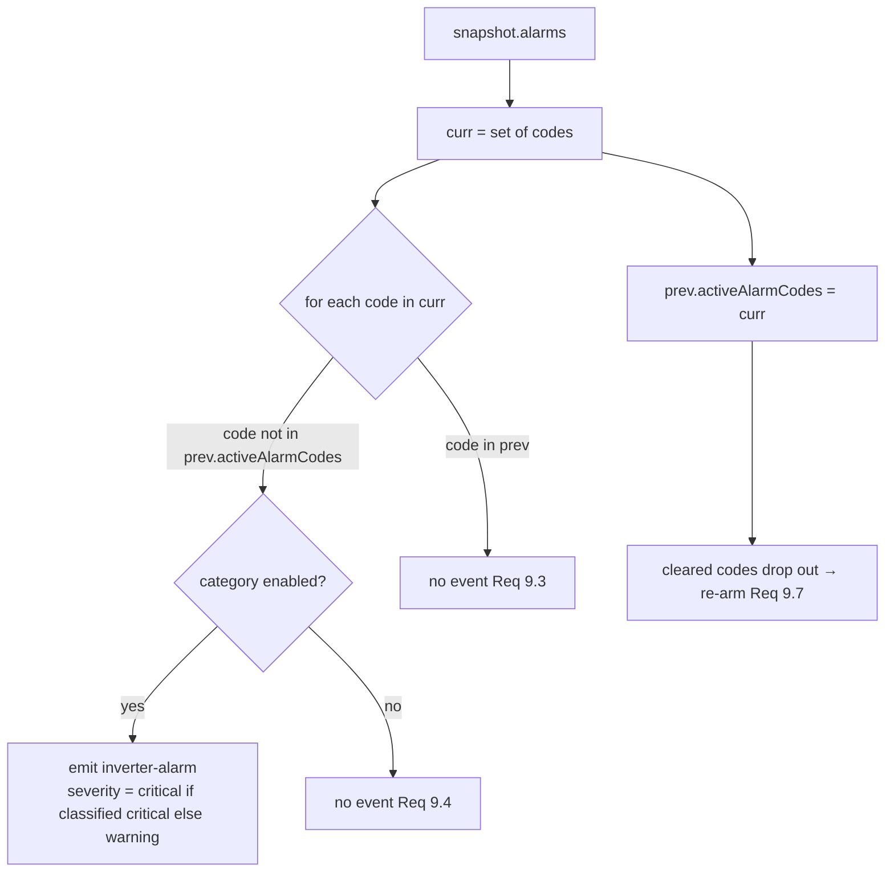

# Design Document

## Overview

This feature set extends the existing `hmip-plugin-fusionsolar` plugin with three groups of enhancements, all implemented against the patterns already present in the codebase (LAN gate + `requireAdmin`, `redactConfig`, `config.deepMerge`/`validateNotifications`, the SSE snapshot shape, bounded ring buffers, `node:test` + `fast-check`). No new runtime dependencies are introduced.

- **(A) Persistent history + export.** `src/history.js` keeps three in-memory tiers (raw 6 h ring, hourly ≤ 96 h, daily ≤ 30 d) that are lost on every restart. We add a `serialize()`/`restore()` pair producing a versioned `History_Store`, a tiny atomic writer (`src/history-store.js`) that persists `/data/history.json` on a periodic unref'd timer and on shutdown, and `index.js` wiring to restore at startup and persist in the existing SIGTERM/SIGINT handlers. Two LAN-gated export endpoints (`/api/history/export.csv`, `/api/history/export.json`) plus Verlauf-tab download buttons round out the group.
- **(B) Inverter alarms + MPPT.** We add the Sun2000 alarm registers (32008/32009/32010) to the register map and a read block, an `ALARM_BITS` map and a pure `decodeAlarms()` helper, derive `snapshot.alarms` in the poller, and add an edge-triggered `inverter-alarm` notification category to the detector and config defaults.
- **(C) Polish.** Bidirectional i18n key parity with a dev/test check; `prefers-color-scheme`-aware initial theme; per-IP failed-login rate limiting in `access.js`; admin+LAN config backup/restore endpoints; and a static PWA manifest (no service worker, no-cache preserved).

The design intentionally keeps all newly-testable logic in **pure functions** (serialize/restore, alarm decode, rate-limiter decisions, CSV formatting, i18n parity, backup/restore merge) so it can be validated with property-based tests, while the Express endpoints, timers, and DOM wiring stay thin and are covered by example/integration tests.

### Research notes

- **Atomic file writes on Node.** The durable pattern that avoids torn/corrupt files on crash is write-to-temp-then-rename: `fs.writeFileSync(tmp, data)` followed by `fs.renameSync(tmp, final)`. `rename(2)` is atomic within the same filesystem, so a reader either sees the old complete file or the new complete file, never a partial one. This mirrors how the existing `config.js` writes, but adds the temp+rename step because `history.json` is written repeatedly on a timer (config is written rarely). Source: Node.js `fs` docs on `rename`.
- **Sun2000 alarm registers.** The Huawei "Solar Inverter Modbus Interface Definitions" documents Alarm 1 (32008), Alarm 2 (32009), Alarm 3 (32010) as `u16` bitfields, each bit mapping to a named fault (e.g. Alarm1 bit0 "High String Input Voltage", bit1 "DC Arc Fault", bit2 "String Reverse Connection"). The exact catalog varies slightly by firmware; the design treats the bit→name map as data (`ALARM_BITS`) so unknown bits degrade gracefully to a generic `alarm-<addr>-bit<n>` identifier (Req 7.4) rather than being dropped. These sit adjacent to the existing `pvAndAc` block start (32016) so they are reachable by extending a read block down to 32008.
- **`prefers-color-scheme`.** `window.matchMedia('(prefers-color-scheme: light)').matches` returns `true` only when the UA actively reports a light preference; when the UA reports `dark` or has no preference, it returns `false`. The requirement maps "no preference" to `dark`, which is exactly the `false` branch, so a single `matchMedia(... light ...).matches ? 'light' : 'dark'` expression satisfies Req 12.1–12.3.
- **PWA installability without a service worker.** A web app manifest (`manifest.webmanifest`) referenced via `<link rel="manifest">` with `name`, `short_name`, `start_url`, `display`, and at least one icon is sufficient for the "installable" criteria on Chromium-based browsers; a service worker is not strictly required for the install prompt on desktop and is explicitly out of scope (the no-cache contract must be preserved). Source: MDN Web App Manifest documentation. Content was rephrased for compliance with licensing restrictions.

## Architecture



The three groups touch distinct seams and do not interact at runtime, except that the poller's snapshot now carries an `alarms` array consumed by both the detector (group B notifications) and the frontend Diagnose tab.

## Components and Interfaces

### Group A — Persistence & export

**`src/history.js` (extended).** Add pure serialization plus a resilient restore that reuses the existing tier arrays.

```js
// Schema version for the persisted store. Bump on incompatible changes.
const HISTORY_STORE_VERSION = 1;

// Build a plain, JSON-safe snapshot of the long-term tiers (and optionally a
// recent raw window). Pure: no I/O, no Date.now() side effects on the tiers.
function serialize({ includeRawWindowMs = 0, now = Date.now() } = {}) /* → History_Store */;

// Restore tiers from a parsed History_Store. Resilient:
//  - wrong/absent version → returns { ok:false, reason } and leaves tiers empty
//  - prunes daily older than DAILY_RETENTION_MS, hourly older than the
//    combined window, skips malformed entries
//  - de-dupes against any already-present open bucket / restored hour
function restore(store, { now = Date.now() } = {}) /* → { ok, restored:{hourly,daily,raw}, skipped } */;

// Convenience used by index.js + the writer.
function persistError(); // last write error (for diagnostics), or null
```

`module.exports` gains `serialize`, `restore`, `HISTORY_STORE_VERSION` alongside the existing exports.

**`src/history-store.js` (new).** Thin I/O wrapper; all policy lives in `history.js`.

```js
const HISTORY_FILE = path.join(DATA_DIR, "history.json"); // DATA_DIR from HMIP_DATA_DIR || "/data"

function writeStoreAtomic(store)          // write tmp + fsync + rename; never throws, returns {ok,error}
function readStore()                      // returns parsed object | null (missing/corrupt → null, logged)
function persist(history, opts)           // history.serialize() → writeStoreAtomic()
function loadInto(history, opts)          // readStore() → history.restore()
function startPeriodicWriter(history, { intervalMs = 5*60*1000, now, setIntervalFn }) // unref'd timer; returns stop()
```

**`src/index.js` (wiring).**
- Startup, before `poller.start()`: `historyStore.loadInto(history)`.
- After boot: `const stopWriter = historyStore.startPeriodicWriter(history)`.
- In existing SIGTERM and SIGINT handlers, before `process.exit(0)`: `historyStore.persist(history)` and `stopWriter()`.

**`src/dashboard/server.js` (endpoints).** LAN-gated, no admin (Req 4.5):

```js
GET /api/history/export.json  // { version, savedAt, hourly, daily } as attachment
GET /api/history/export.csv   // header row + hourly & daily rows as attachment
```

Both set `Content-Disposition: attachment; filename="history-<ISO>.{csv,json}"`. CSV uses a pure formatter `historyToCsv(aggregates)` (see Data Models) so it is unit/property-testable independent of Express.

**`src/dashboard/public/{index.html,app.js}`.** Add a CSV button and a JSON button to the Verlauf (`tab-trend`) section. Both are plain `<a download href="/api/history/export.csv">`-style anchors (or JS that sets `location.href`), so the browser performs a normal attachment download (Req 5).

### Group B — Alarms & MPPT

**`src/sun2000/registers.js` (extended).**

```js
// REG additions
alarm1: { addr: 32008, length: 1, type: "u16", unit: "", rw: "r" },
alarm2: { addr: 32009, length: 1, type: "u16", unit: "", rw: "r" },
alarm3: { addr: 32010, length: 1, type: "u16", unit: "", rw: "r" },
// (optional) optimizerOnlineCount, optimizerSignalQuality — cheap reads if adjacent

// Bit catalog: register addr → bit index → { name, severity }
const ALARM_BITS = {
  32008: { 0: { name: "High String Input Voltage", severity: "critical" }, 1: { name: "DC Arc Fault", severity: "critical" }, /* … */ },
  32009: { /* … */ },
  32010: { /* … */ },
};

// Pure decoder. values: { alarm1, alarm2, alarm3 } (raw u16, may be null).
// → [{ code: "32008:0", name, severity }, …] for every set, in deterministic order.
function decodeAlarms(values) /* → Active_Alarm[] */;
```

The alarm registers are read by extending a block so they arrive during normal polling (Req 6.2). Option chosen: a small dedicated block `alarms` (`start: 32008, count: 3`) added to `READ_BLOCKS` and read in `_tick()` alongside the others. (Extending `pvAndAc` down to 32008 is possible but widens an already-fragile block that fails atomically at dusk; a separate 3-word block isolates that risk.)

**`src/sun2000/poller.js` (extended).** In `_tick()`, read the `alarms` block (best-effort, like meter/battery), keep the raw words in `merged` (Req 6.3), and set `this.snapshot.alarms = decodeAlarms(merged)` (Req 7.5). When the block read fails, `alarms` is left as the previous value or `[]`.

**`src/notifications/detector.js` (extended).**
- Add `"inverter-alarm": { defaultEnabled: true, defaultMinSeverity: "warning" }` to `CATEGORIES`.
- Track `this.prev.activeAlarmCodes` (a `Set`). In `onSnapshot`, compute the current active code set from `snapshot.alarms`; for each code present now but not before, `_emit("inverter-alarm", severity, …)` where severity is `critical` if the alarm's classification is critical else `warning` (Req 9.5). Codes that remain active emit nothing (Req 9.3); a code that cleared and reactivates emits again because it left the set in between (Req 9.7).

**`src/config.js` (extended).** Add `"inverter-alarm": { enabled: true, minSeverity: "warning" }` to `DEFAULTS.notifications.categories` (Req 9.6). `validateNotifications` already validates any category generically, so no change there.

**Frontend.** Diagnose tab gains an "Aktive Alarme" card rendered from `state.snapshot.alarms`; empty array → a localized "no active alarms" line (Req 8).

### Group C — Polish

**i18n (`app.js`).** Extend `I18N.de`/`I18N.en` so every key exists in both, add keys for the new UI (export buttons, alarms card, backup/restore). A pure helper enables testing:

```js
// Exported for tests (e.g. via module.exports when running under node:test,
// guarded so the browser bundle is unaffected).
function i18nKeyParity(table) /* → { missingInEn:[], missingInDe:[] } */;
```

**Theme (`app.js`).** Replace the initializer:

```js
const stored = localStorage.getItem("theme");
let theme = stored || (window.matchMedia && window.matchMedia("(prefers-color-scheme: light)").matches ? "light" : "dark");
```

Toggle handler continues to persist to `localStorage` (Req 12.5).

**Login rate limit (`src/dashboard/access.js`).** Pure-ish limiter keyed by IP:

```js
const loginAttempts = new Map(); // ip → { count, resetAt }

// Decide before evaluating the password. now/window/max injectable for tests.
function checkLoginAllowed(ip, { now, windowMs, max }) /* → { allowed, retryAfterMs } */;
function recordLoginFailure(ip, { now, windowMs, max });
function resetLoginAttempts(ip);
```

`server.js` `/api/admin/login`: call `checkLoginAllowed` first; if blocked → `429` with `Retry-After` and a descriptive body, **without** evaluating the password (Req 13.6). On wrong password → `recordLoginFailure`. On success → `resetLoginAttempts` then issue token (Req 13.3). Window/max come from config defaults `security.loginRateLimit = { windowSec: 900, maxAttempts: 5 }`.

**Config backup/restore (`server.js` + `config.js`).**

```js
GET  /api/config/backup   // requireAdmin + LAN; unredacted full config; attachment (Req 14)
POST /api/config/restore  // requireAdmin + LAN; validate → deepMerge over DEFAULTS → persist (Req 15)
```

Backup returns `getConfig()` raw (NOT `redactConfig`) so secrets round-trip (Req 14.5); documented as plaintext (Req 14.6). Restore reuses `config.validateNotifications` plus a basic shape check, then `deepMerge(DEFAULTS, submitted)` and `save()`. On validation failure → `400`, config unchanged (Req 15.3). A new `config.restore(document)` function encapsulates validate+merge+persist and is the unit/property-test target.

**PWA (`public/manifest.webmanifest` + `index.html`).** Static file served by the existing `express.static` middleware (so it inherits the no-cache headers, Req 16.5). `index.html` adds `<link rel="manifest" href="manifest.webmanifest">`. No service worker is registered anywhere (Req 16.4).

## Data Models

### History_Store (persisted JSON)

```jsonc
{
  "version": 1,                 // HISTORY_STORE_VERSION (Req 1.7)
  "savedAt": 1718000000000,     // ms epoch when serialized
  "hourly": [                   // finalized hourly buckets (shape from history.js finalizeBucket)
    { "start": 1718000000000, "n": 360, "avg": {…}, "min": {…}, "max": {…},
      "energy": { "pvWh": 0, "houseWh": 0, "importWh": 0, "exportWh": 0, "battChargeWh": 0, "battDischargeWh": 0 } }
  ],
  "daily": [                    // condensed daily summaries (shape from foldIntoDaily)
    { "day": 1717977600000, "hours": 24, "energy": {…}, "peakPv": 0, "peakHouse": 0, "minSoc": null, "maxSoc": null }
  ],
  "raw": [ { "t": 1718000000000, "inputPower": 0, … } ]   // optional, only when includeRawWindowMs > 0
}
```

Size bound (Req 3.1): `hourly ≤ 96`, `daily ≤ 30`, `raw ≤ includeRawWindowMs / pollIntervalMs` (default 0). With the documented retention this keeps the file well under ~1 MB.

### Alarm maps

```js
// ALARM_BITS: register address → bit index → classification
{ 32008: { 0: { name, severity }, … }, 32009: {…}, 32010: {…} }

// Active_Alarm (in snapshot.alarms and notification payloads)
{ code: "32008:1", name: "DC Arc Fault", severity: "critical" }
// Unknown bit (Req 7.4):
{ code: "32008:13", name: "alarm-32008-bit13", severity: "warning" }
```

### Login rate-limiter state

```js
// access.js module-level Map, keyed by normalized client IP
ip → { count: number, resetAt: number /* ms epoch when the window expires */ }
// checkLoginAllowed result
{ allowed: boolean, retryAfterMs: number }
```

### CSV export shape

`historyToCsv({ hourly, daily })` produces, in order:
1. A header row naming every column (Req 4.6): `tier,startOrDay,n,pvWh,houseWh,importWh,exportWh,battChargeWh,battDischargeWh,peakPv,peakHouse,minSoc,maxSoc`.
2. One `hourly,…` row per hourly bucket and one `daily,…` row per daily summary.
Values are comma-joined with empty string for absent fields; the first line is always the header even when there are zero data rows.

### Config additions

```js
DEFAULTS.notifications.categories["inverter-alarm"] = { enabled: true, minSeverity: "warning" };
DEFAULTS.security = { loginRateLimit: { windowSec: 900, maxAttempts: 5 } }; // group C
DEFAULTS.history = { persistIntervalSec: 300, rawWindowSec: 0 };           // group A
```

## Module / file changes

| File | Change | Requirements |
| --- | --- | --- |
| `src/history.js` | Add `serialize()`, `restore()`, `HISTORY_STORE_VERSION`; restore reuses existing tier arrays, prunes + de-dupes | 1.1, 1.2, 1.6, 1.7, 2.x, 3.6 |
| `src/history-store.js` (new) | Atomic tmp+rename writer, reader, periodic unref'd timer, `persist`/`loadInto` | 1.3, 1.4, 1.5, 3.2–3.5 |
| `src/index.js` | Restore at startup; start periodic writer; persist in SIGTERM/SIGINT | 1.3–1.6 |
| `src/dashboard/server.js` | `export.csv`/`export.json` (LAN, no admin); `config/backup`+`config/restore` (admin+LAN); login rate-limit gate; serve manifest via static | 4.x, 13.x, 14.x, 15.x, 16.1/16.5 |
| `src/dashboard/access.js` | `checkLoginAllowed`/`recordLoginFailure`/`resetLoginAttempts` + per-IP Map | 13.x |
| `src/sun2000/registers.js` | `alarm1/2/3` REG entries, `alarms` read block, `ALARM_BITS`, `decodeAlarms()` | 6.x, 7.x, 10.x |
| `src/sun2000/poller.js` | Read alarm block, retain raw words, set `snapshot.alarms` | 6.3, 7.5, 10.2 |
| `src/notifications/detector.js` | `inverter-alarm` category + edge-triggered emission with severity | 9.1–9.5, 9.7 |
| `src/config.js` | Defaults: `inverter-alarm` category, `security.loginRateLimit`, `history`; add `restore()` | 9.6, 13.x, 15.x |
| `src/dashboard/public/index.html` | Verlauf export buttons, Diagnose alarms card, manifest link, backup/restore controls | 5.1, 8.x, 14/15 UI, 16.2 |
| `src/dashboard/public/app.js` | i18n parity + new keys, theme initializer, export/backup/restore wiring, alarms render | 5.2/5.3, 8.x, 11.x, 12.x |
| `src/dashboard/public/manifest.webmanifest` (new) | name, short_name, start_url, display, icons | 16.3 |

## Persistence flow



## Alarm edge-detection



## Error Handling

- **Missing history file** (Req 3.2): `readStore()` returns `null`; `restore(null)` leaves tiers empty; startup continues.
- **Corrupt JSON** (Req 3.3): `readStore()` catches the parse error, logs a warning, returns `null` → empty tiers.
- **Unknown schema version** (Req 3.4): `restore()` checks `store.version === HISTORY_STORE_VERSION`; mismatch → `{ ok:false, reason:"version" }`, tiers empty.
- **Malformed individual entries** (Req 3.6): `restore()` validates each entry's required fields (`start`/`day` numeric, `energy` object); malformed entries are skipped, valid in-range entries retained.
- **Write failure** (Req 3.5): `writeStoreAtomic` wraps `try/catch`, logs via `log.error`, records `persistError`, returns `{ ok:false }`; the timer and process keep running. Temp file is best-effort unlinked on failure.
- **Export with no data**: endpoints still return a valid document — CSV with header only, JSON with empty arrays.
- **Alarm block read failure**: treated like the existing meter/battery best-effort reads; `snapshot.alarms` retains its prior value rather than flapping to empty (avoids false "alarm cleared" → re-arm storms).
- **Rate-limit edge**: a successful login always resets the counter even if the IP was near the limit; a blocked request returns `429` deterministically and never touches `passwordMatches`.
- **Restore validation failure** (Req 15.3): `config.restore` validates before mutating; on failure it throws, the route returns `400`, and `current` config is untouched.
- **Backup secret handling** (Req 14.6): endpoint documented as returning plaintext secrets; it is admin + LAN gated and marked `Content-Disposition: attachment`.

## Correctness Properties

*A property is a characteristic or behavior that should hold true across all valid executions of a system — essentially, a formal statement about what the system should do. Properties serve as the bridge between human-readable specifications and machine-verifiable correctness guarantees.*

The following properties are derived from the testable acceptance criteria (see prework). Redundant criteria were consolidated: serialize/restore equivalence is one round-trip property; daily and hourly retention pruning are one property; the resilience criteria (unknown version, corrupt/missing, malformed entries) are one resilient-restore property; the alarm bit-mapping criteria are one decode property; and the alarm edge/continuous/re-arm criteria are one edge-trigger property.

### Property 1: History persistence round-trip

*For any* in-memory Hourly_Tier and Daily_Tier, serializing them into a History_Store and then JSON-encoding, JSON-decoding, and restoring that store SHALL produce Hourly_Tier and Daily_Tier collections equivalent to the originals (all entries within the retention window preserved field-for-field).

**Validates: Requirements 1.1, 1.6, 2.1**

### Property 2: Retention pruning on restore

*For any* History_Store containing hourly and daily entries with arbitrary timestamps relative to a restore time `now`, restoring SHALL retain only daily entries whose day is within the Daily_Tier retention window and only hourly entries whose start is within the combined retention window, and SHALL discard all out-of-window entries.

**Validates: Requirements 2.2, 2.3**

### Property 3: Bounded store

*For any* tiers (including oversized inputs exceeding the documented caps), the result of restore-then-serialize SHALL contain at most 96 hourly entries, at most 30 daily entries, and at most `rawWindowMs / pollIntervalMs` raw entries.

**Validates: Requirements 3.1**

### Property 4: Resilient restore

*For any* input given to restore — including `null`, arbitrary/garbage strings, objects with a version other than the current schema version, and arrays mixing valid and malformed entries — restore SHALL NOT throw, SHALL yield empty tiers when the input is missing, unparseable, or carries an unrecognized version, and otherwise SHALL retain every valid in-window entry while skipping malformed ones.

**Validates: Requirements 3.3, 3.4, 3.6**

### Property 5: Raw-window selection

*For any* raw sample ring and any configured raw window `w`, serializing with `includeRawWindowMs = w` at time `now` SHALL include exactly the raw samples whose timestamp is `>= now - w` and no others.

**Validates: Requirements 1.2**

### Property 6: No duplicate hourly buckets after restore

*For any* restored Hourly_Tier and any subsequently ingested Snapshot, the resulting Hourly_Tier SHALL contain no two buckets with the same `start` (the new sample folds into the matching restored hour rather than creating a duplicate).

**Validates: Requirements 2.4**

### Property 7: Alarm decode bit-correspondence

*For any* combination of raw `u16` values for the alarm registers (32008/32009/32010), `decodeAlarms` SHALL produce exactly one Active_Alarm per set bit and none for clear bits; each Active_Alarm SHALL use the defined name when the bit is in the catalog and a generic identifier embedding the register address and bit position otherwise; an all-zero input SHALL produce an empty list.

**Validates: Requirements 7.1, 7.2, 7.3, 7.4**

### Property 8: Alarm notifications are edge-triggered with re-arm

*For any* sequence of consecutive Snapshots with arbitrary active-alarm code sets, the Event_Detector SHALL emit exactly one `inverter-alarm` event for each code that is active in the current Snapshot but was not active in the previous one, SHALL emit nothing for codes continuously active across consecutive Snapshots, and SHALL emit again for a code that became inactive and later reactivated.

**Validates: Requirements 9.2, 9.3, 9.7**

### Property 9: Alarm category enable gate

*For any* alarm transition sequence, when the `inverter-alarm` category is disabled in configuration the Event_Detector SHALL emit no `inverter-alarm` events, and when enabled it SHALL emit them according to the edge-trigger rule.

**Validates: Requirements 9.4**

### Property 10: Alarm severity mapping

*For any* newly-active alarm code, the emitted `inverter-alarm` event SHALL have severity `critical` when the alarm's classification is critical and severity `warning` otherwise.

**Validates: Requirements 9.5**

### Property 11: i18n bidirectional key parity

*For any* Translation_Key present in the German entry set, the English entry set SHALL contain that key, and vice versa (the symmetric difference of the German and English key sets is empty).

**Validates: Requirements 11.1, 11.2, 11.3**

### Property 12: Initial-theme decision

*For all* combinations of stored Theme_Preference (`null`, `"light"`, `"dark"`) and reported `prefers-color-scheme` light/not-light, the initial theme SHALL equal the stored preference when one exists, otherwise `light` when the user agent reports a light preference, otherwise `dark`.

**Validates: Requirements 12.1, 12.2, 12.3, 12.4**

### Property 13: Login rate-limit threshold and window reset

*For any* sequence of failed login attempts from a single IP, attempts SHALL be permitted while the failure count within the window is below the configured maximum, SHALL be rejected once the count reaches the maximum, and SHALL be permitted again once the configured window has elapsed (clock injected).

**Validates: Requirements 13.1, 13.2, 13.4**

### Property 14: Login rate-limit per-IP independence

*For any* two distinct source IPs, exhausting the failed-attempt budget for one IP SHALL NOT cause attempts from the other IP to be rejected, and a successful attempt from an IP SHALL reset only that IP's failure count.

**Validates: Requirements 13.3, 13.5**

### Property 15: Config backup/restore round-trip

*For any* valid configuration, exporting a Config_Backup and then restoring that document SHALL produce a configuration equivalent to the exported one.

**Validates: Requirements 15.6**

### Property 16: Restore merges over defaults

*For any* valid (possibly partial) configuration document, restoring it SHALL produce a configuration in which every key absent from the document equals the documented default value.

**Validates: Requirements 15.7**

### Property 17: Invalid restore leaves configuration unchanged

*For any* configuration document that fails validation, the restore operation SHALL reject the document and leave the existing in-memory configuration unchanged.

**Validates: Requirements 15.2, 15.3**

### Property 18: CSV export always has a stable header

*For any* aggregate data (including empty tiers), the CSV produced by `historyToCsv` SHALL have, as its first line, the fixed column header, and every data row SHALL have the same number of columns as the header.

**Validates: Requirements 4.6**

## Error Handling (notification edge cases)

The detector treats a failed alarm-block read as "no change" rather than "all cleared", preventing a flapping read from generating spurious re-arm events. The rate limiter never blocks a successful authentication: `resetLoginAttempts` runs on success before issuing a token, so a legitimate user who finally types the right password is not locked out by their own earlier typos within the window.

## Testing Strategy

Testing follows the repository's established approach: `node:test` as the runner (`npm test` → `node --test`) and `fast-check` (already a dev dependency, v4) for property-based tests. Existing tests live under `test/` with `.prop.test.js` for property tests and `.test.js` for example tests; new tests follow the same convention.

### Dual approach

- **Property tests** validate the universal properties above over generated inputs. Pure logic is extracted specifically so it can be tested without Express, timers, or the DOM: `serialize`/`restore` and `historyToCsv` (history.js / a small csv helper), `decodeAlarms` (registers.js), the detector's alarm edge logic (detector.js), `checkLoginAllowed`/`recordLoginFailure`/`resetLoginAttempts` (access.js), `initialTheme` and `i18nKeyParity` (app.js, exported under a `module.exports` guard so the browser bundle is unaffected), and `config.restore`.
- **Example / integration tests** cover the thin wiring: endpoint behavior (LAN gating → 403, admin gating → 401/200, `Content-Disposition` presence, CSV content type, manifest served with the no-cache header), the periodic writer (with an injected fake clock and a spy writer asserting one write per interval), the SIGTERM/SIGINT persist-before-exit path (spy `persist`, stubbed `process.exit`), poller alarm wiring (fake modbus returning alarm words → `snapshot.alarms` populated), and DOM presence checks for the Verlauf buttons, alarms card, and manifest link.

### Property test configuration

- Each property test runs a minimum of 100 iterations (fast-check default ≥ 100; set explicitly via `{ numRuns: 100 }` where defaults differ).
- Each correctness property is implemented by a **single** property-based test.
- Each property test is tagged with a comment referencing the design property, in the format:
  `// Feature: persistent-history-and-enhancements, Property {number}: {property_text}`
- Clocks and randomness sources are injected (the detector already accepts `{ now }`; the writer and rate limiter take injectable `now`/`setIntervalFn`) so time-dependent properties (retention pruning, raw-window selection, rate-limit window reset, periodic writer) are deterministic.

### What is intentionally NOT property-tested

- The PWA manifest, HTML link, and absence of a service worker are configuration/static checks → example/smoke tests (parse the manifest for required fields; grep the source to confirm no `serviceWorker.register`).
- Express endpoint plumbing and LAN/admin gating reuse existing, already-tested middleware → a few representative integration examples rather than property tests.
- Signal-handler and timer wiring are side-effect orchestration → example tests with spies/fakes.
- The "documented plaintext-secrets caveat" (14.6) and "limited register set" (10.3) are review-time documentation/design checks, not automated tests.

### Mapping (property → primary target module)

| Property | Module under test |
| --- | --- |
| 1–6 | `src/history.js` (`serialize`/`restore`) |
| 7 | `src/sun2000/registers.js` (`decodeAlarms`) |
| 8–10 | `src/notifications/detector.js` |
| 11, 12 | `src/dashboard/public/app.js` (`i18nKeyParity`, `initialTheme`) |
| 13, 14 | `src/dashboard/access.js` (login limiter) |
| 15–17 | `src/config.js` (`restore`) |
| 18 | history CSV helper (`historyToCsv`) |
