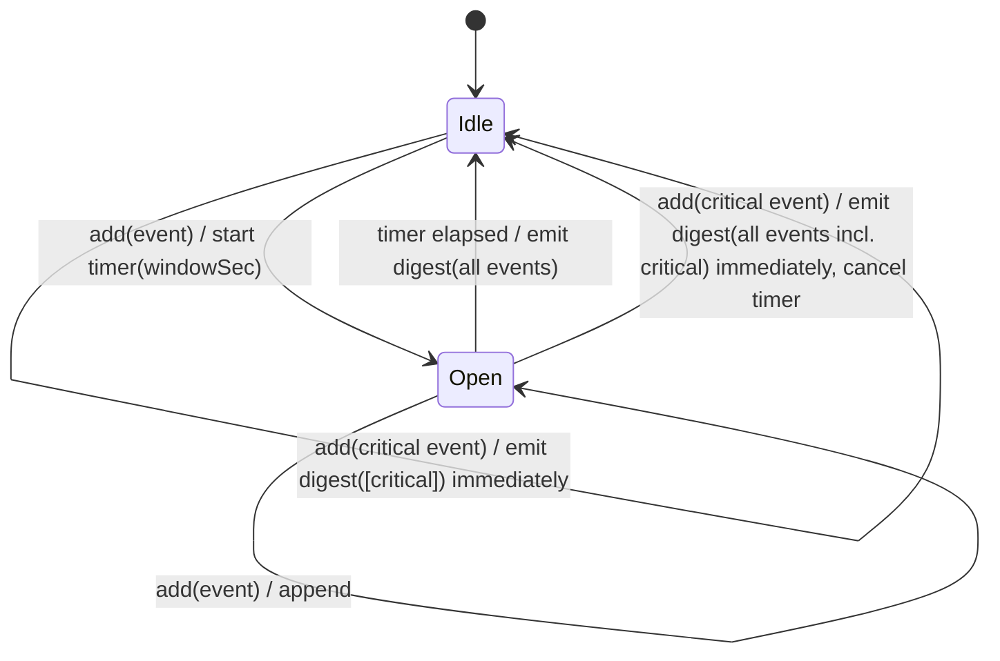
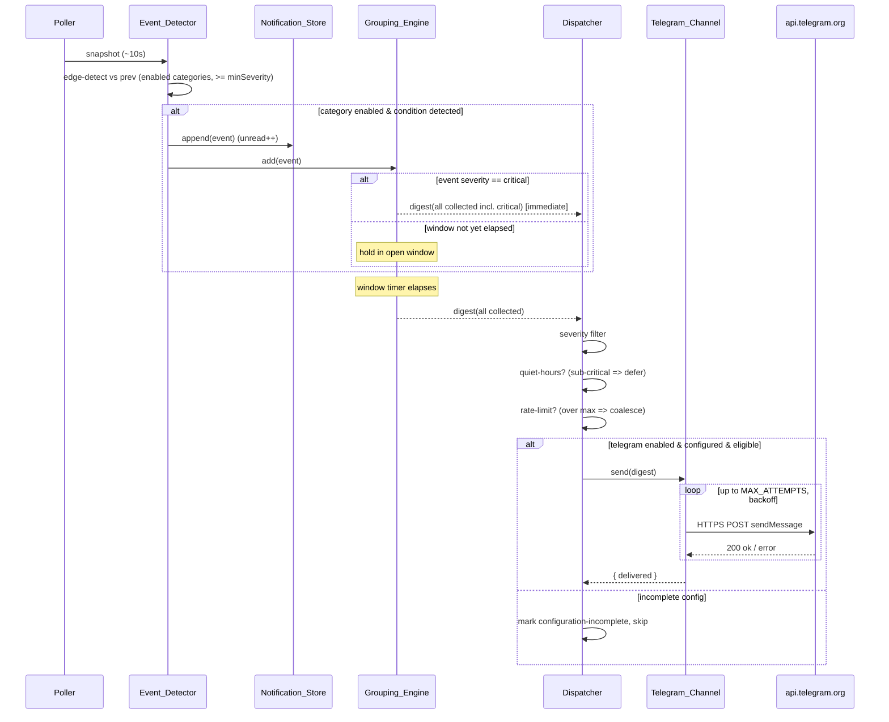
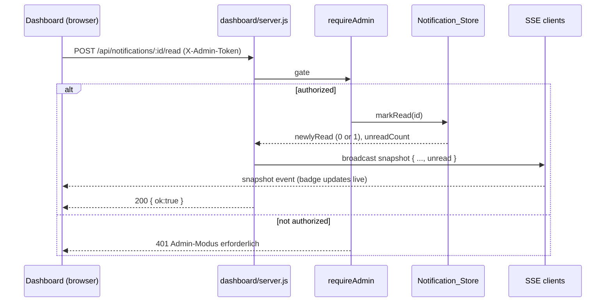

# Design Document

## Overview

The notification system adds configurable alerting to the `hmip-plugin-fusionsolar`
plugin with two delivery surfaces: outbound **Telegram** messages and an in-dashboard
**Notification Center**. It observes the runtime sources the plugin already produces
(poller snapshots, Modbus connection/lockdown state, HCU WebSocket lifecycle), turns
state changes and threshold crossings into `Notification_Event`s, coalesces related
events inside a configurable time window into a single `Digest_Message`, then dispatches
each digest to eligible channels subject to category filtering, quiet hours, and rate
limits.

The design follows the conventions already established in the codebase rather than
introducing new infrastructure:

- **Event observation** rides on the existing `poller.on("snapshot")`, `hcu` `open`/`close`
  events, and `modbus.getStatus()` — without disturbing those flows. The detector is a
  passive subscriber; it never blocks or mutates the poller or HCU paths.
- **Bounded storage** reuses the ring-buffer + age-based-reduction style of `logger.js`
  and `hcuLog.js` for the `Notification_Store`.
- **Configuration** extends `config.js` `DEFAULTS` with a `notifications` block, loaded and
  saved through the existing `load()`/`save()`/`get()` pattern, with hot-reload via
  `config.get()`.
- **Secret handling** extends the `redactConfig()` pattern in `dashboard/server.js` (the
  same treatment as `cloudPassword`/`adminPassword`) and the placeholder-preserve logic
  in `index.js` `saveConfig`.
- **API endpoints** are added under `/api` and wired into `buildServer`, gated by the
  existing LAN gate and `requireAdmin` middleware. The unread count rides along the
  existing SSE `buildPayload()` so the dashboard badge updates live without polling.
- **Telegram delivery** uses Node's built-in `https` module to POST to
  `api.telegram.org` — zero new runtime dependencies, and explicitly no Python.

### Research Notes

- **Telegram Bot HTTP API**: messages are sent via
  `POST https://api.telegram.org/bot<token>/sendMessage` with a JSON body
  `{ chat_id, text, parse_mode }`. A success response has HTTP 200 and `{ "ok": true }`.
  Errors return `{ "ok": false, "error_code", "description" }`; HTTP 429 includes a
  `parameters.retry_after` seconds hint. Reference:
  [Telegram Bot API – sendMessage](https://core.telegram.org/bots/api#sendmessage).
  This is reachable with Node's built-in `https.request` — no dependency required.
  Message text is capped at 4096 UTF-16 code units, which constrains digest formatting.
- **Node built-in fetch**: available since Node 18. The container base image
  (`alpine-node-*`) ships a modern Node, but to avoid any version coupling the design
  uses the always-present `https` module behind a thin `httpPost` helper, so the channel
  works regardless of whether global `fetch` is present.
- **Existing redaction pattern**: `redactConfig()` replaces secret values with the
  `"•••"` placeholder on read, and `index.js`/`server.js` drop the placeholder on write
  so a redacted round-trip never overwrites the stored secret. The Bot_Token follows this
  exact contract.

## Architecture

The notification system is a self-contained subsystem under `src/notifications/`. It is
instantiated once in `index.js`, subscribed to existing event sources, and exposes a small
surface to the dashboard server.

```mermaid
flowchart TB
    subgraph sources[Existing runtime sources]
        POLL[poller snapshot event]
        MODBUS[modbus.getStatus errors/lockdown]
        HCUWS[hcu open/close events]
    end

    subgraph notif[src/notifications]
        DET[detector.js<br/>Event_Detector]
        GRP[grouping.js<br/>Grouping_Engine]
        DISP[dispatcher.js<br/>Dispatcher]
        TG[telegram.js<br/>Telegram_Channel]
        STORE[store.js<br/>Notification_Store]
    end

    subgraph existing[Existing modules]
        CFG[config.js]
        SRV[dashboard/server.js]
        LOG[logger.js]
    end

    POLL --> DET
    MODBUS --> DET
    HCUWS --> DET
    DET -->|Notification_Event| GRP
    DET -->|append| STORE
    GRP -->|Digest_Message| DISP
    DISP -->|eligible| TG
    TG -->|HTTPS POST| API[(api.telegram.org)]
    CFG -.config.get hot values.-> DET & GRP & DISP & TG & STORE
    STORE -->|unread count| SRV
    SRV -->|SSE snapshot incl. unread badge| UI[Dashboard]
    TG -.delivery failure.-> LOG
```

The detector both feeds the grouping engine (for delivery) and appends to the store (for
the Notification Center). These are independent paths: even when Telegram is unreachable,
the store keeps filling and the dashboard keeps updating (Requirement 5.x, 6.5).

### Module layout

| File | Responsibility |
|------|----------------|
| `src/notifications/index.js` | Wires the subsystem: constructs store, grouping, dispatcher, telegram, detector; exposes `attach({ poller, hcu })` and the dashboard-facing API (`listUnread`, `markRead`, `markAllRead`, `unreadCount`, `sendTest`). |
| `src/notifications/detector.js` | `Event_Detector`. Subscribes to sources, holds previous-snapshot state for edge detection (SOC thresholds, connection transitions, energy milestones), emits `Notification_Event`s for enabled categories at/above min severity. |
| `src/notifications/grouping.js` | `Grouping_Engine`. Time-window batching state machine with critical-flush. |
| `src/notifications/dispatcher.js` | `Dispatcher`. Category/severity filtering, quiet-hours deferral, rate-limit coalescing; routes to channels. |
| `src/notifications/telegram.js` | `Telegram_Channel`. Formats digests, performs HTTPS POST with retry/backoff, reports delivery outcome. |
| `src/notifications/store.js` | `Notification_Store`. Bounded ring buffer of events + read-state, unread count, mark-read/mark-all-read. |
| `src/notifications/format.js` | Pure digest-text formatting (testable in isolation). |

### Integration points (no disturbance to existing flows)

`index.js` after `poller` and `hcu` are constructed:

```js
const notifications = require("./notifications");
notifications.init(config.get);          // reads hot config via config.get
notifications.attach({ poller, hcu });   // passive subscriptions
```

`attach` adds listeners only:

```js
poller.on("snapshot", (snap) => detector.onSnapshot(snap)); // additional listener, existing one untouched
hcu.on("open",  () => detector.onHcuState(true));
hcu.on("close", () => detector.onHcuState(false));
```

The poller already supports multiple listeners (`EventEmitter`); adding one does not
change the existing `history.pushSnapshot` / `publishStatusEvents` listener. Modbus
error/lockdown state is **polled** from `modbus.getStatus()` inside `onSnapshot` (which
fires ~every 10 s) rather than by hooking modbus internals, keeping the detector decoupled
from the modbus module's private socket handling.

Config hot-reload: the existing `saveConfig`/`configUpdateRequest` paths call
`config.save()`; the notification subsystem reads `config.get().notifications` on every
event, so updated settings take effect for subsequent events without restart
(Requirement 9.5). No new restart hook is required.

## Components and Interfaces

### Event_Detector (`detector.js`)

Holds the minimal previous-state needed for edge detection. All thresholds and enable
flags are read live from `config.get().notifications` so changes apply immediately.

```js
class EventDetector extends EventEmitter {
  constructor(getConfig) { ... }          // getConfig === config.get
  onSnapshot(snapshot) { ... }            // poller "snapshot"
  onHcuState(connected) { ... }           // hcu open/close
  // emits: "event" -> Notification_Event
}
```

Detection rules (each guarded by its category's `enabled` flag and `minSeverity`):

- **connection**: compare `snapshot.connected` and derived `standby`/`tcp`
  (`modbus.getStatus().connected`) against the previous reading; emit on transition.
- **modbus-error**: read `getStatus()`; emit when `lastError` changes to a socket-level
  error or when lockdown engages (detected via a rising `readsError` + persistent
  disconnect). Severity `warning`, escalating to `critical` for lockdown.
- **hcu**: emit on `open`→connected / `close`→disconnected transitions.
- **battery-soc-low / battery-soc-full**: edge-triggered on `values.batterySoc` crossing
  the configured `lowSocPct` / `fullSocPct` relative to the previous snapshot.
- **energy-milestone**: emit when `floor(dailyYield / milestoneKwh)` increases.
- **power-peak**: emit when `inputPower` exceeds the configured peak threshold and the
  previous sample was below it (edge-triggered, debounced per day).
- **device-status**: emit when `values.deviceStatusText` changes.

The detector is the only place that maps a raw source change to a category + severity. A
disabled category short-circuits before any event is constructed (Requirement 1.3).

### Grouping_Engine (`grouping.js`)

A single open window at a time. Implemented with a timer, mirroring the timer discipline
already used in `poller.js` (`setTimeout` + `unref` where appropriate).

```js
class GroupingEngine extends EventEmitter {
  constructor(getConfig) { ... }
  add(event) { ... }            // opens window if none open; critical => immediate flush
  flush() { ... }               // emits "digest" -> Digest_Message, clears window
  // emits: "digest"
}
```

State machine:



A critical event flushes immediately together with any events already collected in the open
window (Requirement 3.7), guaranteeing no collected event is lost on early flush
(Requirement 3.6). A window flushed with a single event still yields a valid digest
(Requirement 3.5).

### Dispatcher (`dispatcher.js`)

```js
class Dispatcher {
  constructor(getConfig, { telegram }) { ... }
  dispatch(digest) { ... }       // filter -> quiet-hours -> rate-limit -> channel
  onQuietHoursEnd() { ... }      // flush deferred digests
}
```

Pipeline for each `Digest_Message`:

1. **Severity filter**: drop events below the category's `minSeverity`; if the digest is
   emptied, it is not delivered (Requirement 1.6).
2. **Quiet hours**: if `now` is within `[quietStart, quietEnd)` and the digest's highest
   severity is below `critical`, hold it in a deferred queue (Requirement 7.2). Critical
   digests pass through (Requirement 7.4). When quiet hours end, deferred digests are
   delivered (Requirement 7.3).
3. **Rate limit**: a sliding counter over `rateIntervalSec`. Once `maxPerInterval` is
   reached, further digests are merged into a single pending **coalesced** digest that is
   delivered (not suppressed) when capacity returns (Requirement 7.6).
4. **Channel routing**: if `telegram.enabled` and both `botToken` and `chatId` are present,
   route to the Telegram_Channel (Requirement 4.3); if enabled but incomplete, mark
   configuration-incomplete and skip delivery (Requirement 4.4).

Quiet-hours window end is detected lazily: on each dispatch, and via a low-frequency timer,
the dispatcher checks whether it has transitioned out of quiet hours and flushes the
deferred queue.

### Telegram_Channel (`telegram.js`)

```js
class TelegramChannel {
  constructor(getConfig) { ... }
  isConfigured() { ... }                      // botToken && chatId
  async send(digest) { ... }                  // returns { delivered:boolean, reason? }
  async sendTest() { ... }                    // returns delivery outcome
}
```

- Formats the digest via `format.js`, truncating to the Telegram 4096-char limit.
- Performs `httpPost("https://api.telegram.org/bot<token>/sendMessage", body)` using Node's
  built-in `https` module.
- **Retry/backoff** (Requirement 6.2): up to `MAX_ATTEMPTS` total (initial + retries), with
  exponentially increasing delay (`base * 2^n`), capped, honoring a `retry_after` hint on
  HTTP 429. On success records delivered (6.1); on exhaustion records failed and logs the
  reason without the token (6.3, 8.5).
- Never throws into the dispatcher: a thrown/failed send is caught and reported as
  `{ delivered:false }` so the rest of the system keeps running (6.5).

### Notification_Store (`store.js`)

Bounded ring buffer, mirroring `logger.js`/`hcuLog.js` retention discipline.

```js
const MAX_NOTIFICATIONS = 500;     // documented bound (Requirement 5.10)

function append(event) { ... }     // push; shift oldest when over bound; unread++
function listUnread() { ... }      // unread events, newest first
function listGrouped() { ... }     // unread grouped by category (Requirement 5.3)
function markRead(id) { ... }      // set read-state; returns count newly read (0 or 1)
function markAllRead() { ... }     // set all read atomically; returns count newly read
function unreadCount() { ... }     // number with read-state unread
```

The store keeps an `unreadCount` counter maintained incrementally on append/markRead/
markAllRead so `buildPayload()` can include it cheaply on every SSE tick.

### Dashboard API (wired into `buildServer`)

`buildServer` gains a `notifications` dependency (the subsystem facade) and these routes:

| Method & path | Gate | Behavior |
|---------------|------|----------|
| `GET /api/notifications` | LAN | Returns unread events grouped by category + `unread` count (Requirement 5.2, 5.3). |
| `GET /api/notifications/unread` | LAN | Returns `{ unread: <count> }` (Requirement 5.6). |
| `POST /api/notifications/:id/read` | `requireAdmin` | Mark one read; rebroadcast snapshot (5.4, 5.7, 5.9). |
| `POST /api/notifications/read-all` | `requireAdmin` | Mark all read atomically; rebroadcast (5.5). |
| `POST /api/notifications/telegram/test` | `requireAdmin` | Send Telegram test; return outcome (4.5, 4.6). |

`buildPayload()` is extended with `unread: notifications.unreadCount()` so every SSE
`snapshot` carries the current badge count; the dashboard updates live without polling
(Requirement 5.6, 5.8). Mark-read endpoints call the existing `broadcast("snapshot", …)`
to push the decremented count immediately (5.7).

### Frontend integration (`public/`)

- A new `"notifications"` entry in the `TABS` array and a matching `<section id="tab-notifications">`
  in `index.html`, following the existing tab pattern.
- The SSE `snapshot` handler already merges `data` into `state`; the badge reads
  `state.unread` and renders a count bubble on the tab button.
- `activateTab("notifications")` calls `loadNotifications()` → `GET /api/notifications`,
  rendering unread events grouped by category (reusing the `dl()`/`escape()` helpers).
- Mark-as-read and mark-all-read buttons use the existing `writeJSON()` (which carries the
  admin token and handles 401) so they participate in the admin session flow.
- A Telegram test button in the Config tab calls the test endpoint via `writeJSON()`.

### Config tab additions

The Config tab's field list gains notification settings (category enable toggles, min
severities, thresholds, grouping window, quiet hours, rate limit, Telegram token/chat id).
The Bot_Token field renders the redaction placeholder `"•••"` when a token is stored,
matching the existing `cloudPassword`/`adminPassword` UX.

## Data Models

### Notification_Event

```js
{
  id: "evt_<timestamp>_<rand>",   // stable unique id
  category: "battery-soc-low",    // Notification_Category key
  severity: "warning",            // "info" | "warning" | "critical"
  title: "Batterie niedrig",
  message: "SOC 18% (Schwelle 20%)",
  data: { soc: 18, threshold: 20 }, // structured context (optional)
  t: 1700000000000,               // epoch ms
  read: false                     // Read_State
}
```

### Digest_Message

```js
{
  id: "dig_<timestamp>_<rand>",
  events: [ <Notification_Event>, ... ], // 1..N collected in the window
  highestSeverity: "critical",           // max severity across events
  coalesced: false,                      // true when produced by rate-limit coalescing
  createdAt: 1700000000000
}
```

`events.length` always equals the number of events added to the window at flush time
(Requirement 3.6).

### Notification_Category catalog

Defined as a constant catalog with documented defaults (Requirement 1.1, 1.7):

| key | default enabled | default minSeverity | notes |
|-----|-----------------|---------------------|-------|
| `connection` | true | warning | Modbus connection/standby transitions |
| `modbus-error` | true | warning | errors; lockdown → critical |
| `hcu` | true | warning | HCU WebSocket connect/disconnect |
| `battery-soc-low` | true | warning | crosses `lowSocPct` downward |
| `battery-soc-full` | false | info | crosses `fullSocPct` upward |
| `energy-milestone` | false | info | each `milestoneKwh` of daily yield |
| `power-peak` | false | info | crosses `peakPowerW` upward |
| `device-status` | true | info | `deviceStatusText` changes |

### Config schema additions (`config.js` DEFAULTS)

```js
notifications: {
  categories: {
    connection:       { enabled: true,  minSeverity: "warning" },
    "modbus-error":   { enabled: true,  minSeverity: "warning" },
    hcu:              { enabled: true,  minSeverity: "warning" },
    "battery-soc-low":{ enabled: true,  minSeverity: "warning" },
    "battery-soc-full":{ enabled: false, minSeverity: "info" },
    "energy-milestone":{ enabled: false, minSeverity: "info" },
    "power-peak":     { enabled: false, minSeverity: "info" },
    "device-status":  { enabled: true,  minSeverity: "info" },
  },
  thresholds: {
    lowSocPct: 20,         // 0..100
    fullSocPct: 98,        // 0..100
    milestoneKwh: 5,       // kWh increment
    peakPowerW: 8000,      // W
  },
  groupingWindowSec: 60,   // Grouping_Window duration
  quietHours: { start: "22:00", end: "07:00" },
  rateLimit: { maxPerInterval: 10, intervalSec: 3600 },
  telegram: { enabled: false, botToken: "", chatId: "" },
}
```

Loaded via the existing `{ ...DEFAULTS, ...parsed }` merge in `config.js`. Because the
merge is shallow, `config.load()` is extended to deep-merge the `notifications` sub-object
so absent nested values fall back to documented defaults (Requirement 1.7, 9.4). Validation
of threshold ranges happens on save, rejecting out-of-range updates with a descriptive
error (Requirement 2.7).

### Secret handling

`redactConfig()` is extended to replace `notifications.telegram.botToken` with `"•••"`
when set (Requirement 8.1). The `saveConfig` placeholder-drop logic in `index.js` and the
dashboard `POST /api/config` handler are extended so a submitted `"•••"` token preserves
the stored token (Requirement 8.2), while any other value overwrites it (Requirement 8.3).
The token is never passed to `logger`; the Telegram channel logs failures by reason/status
only (Requirement 8.5).

### Persistence and hot-reload

All notification config persists in `/data/config.json` via `config.save()`
(Requirement 9.1). On startup `config.load()` reads it (9.2); a corrupt/unreadable config
file already causes `load()` to log an error — for the notification subsystem this is
elevated so the plugin fails fast and logs the reason when persisted notification config
cannot be parsed (Requirement 9.3). Absent values fall back to defaults (9.4). The
serialize→load round-trip reproduces an equivalent config (9.6).

## Flow Diagrams

### Event → digest → dispatch → Telegram



### Mark-as-read → unread badge



## Correctness Properties

*A property is a characteristic or behavior that should hold true across all valid
executions of a system — essentially, a formal statement about what the system should do.
Properties serve as the bridge between human-readable specifications and machine-verifiable
correctness guarantees.*

### Property 1: Category enable/disable governs event production

*For any* catalog configuration and any source condition that maps to a category, the
Event_Detector produces exactly one Notification_Event for that category when the category
is enabled, and produces zero events for that category when it is disabled.

**Validates: Requirements 1.3, 1.4**

### Property 2: Severity filtering excludes low-severity events from delivery

*For any* Digest_Message containing events with arbitrary severities, the Dispatcher
delivers only those events whose severity is greater than or equal to their category's
configured minimum severity, and excludes all others.

**Validates: Requirements 1.6**

### Property 3: Absent configuration values fall back to documented defaults

*For any* partial notification configuration with an arbitrary subset of keys omitted, the
effective loaded configuration equals the documented default for every omitted key and the
provided value for every present key.

**Validates: Requirements 1.7, 9.4**

### Property 4: Battery SOC threshold crossings are edge-triggered

*For any* pair of consecutive SOC readings (prev, next) and threshold, a low-battery event
is produced if and only if `prev > lowThreshold` and `next <= lowThreshold`, and a
full-battery event is produced if and only if `prev < fullThreshold` and
`next >= fullThreshold`.

**Validates: Requirements 2.3, 2.4**

### Property 5: Daily energy milestone crossings produce events on multiple increase

*For any* consecutive daily-yield readings (prev, next) and positive milestone increment
`inc`, a daily-energy-milestone event is produced if and only if
`floor(next / inc) > floor(prev / inc)`.

**Validates: Requirements 2.6**

### Property 6: Threshold validation rejects out-of-range updates

*For any* threshold configuration update, the Config_Store accepts it and stores it when
every threshold is within its documented range, and rejects it with a descriptive error
leaving stored configuration unchanged when any threshold is out of range.

**Validates: Requirements 2.7**

### Property 7: Digest completeness

*For any* sequence of non-critical Notification_Events added to a single Grouping_Window,
the Digest_Message produced at flush contains exactly the multiset of events that were
added — the count of represented events equals the count added, with no loss and no
duplication.

**Validates: Requirements 3.2, 3.3, 3.4, 3.5, 3.6**

### Property 8: Critical events flush immediately while preserving completeness

*For any* open Grouping_Window state and an added event of severity `critical`, the
Grouping_Engine emits a Digest_Message immediately (without waiting for the window to
elapse) that contains the critical event together with every event previously collected in
that window.

**Validates: Requirements 3.7**

### Property 9: Telegram channel eligibility

*For any* Telegram configuration, the Dispatcher attempts delivery to the Telegram_Channel
if and only if the channel is enabled and both the Bot_Token and the Chat_Id are non-empty;
otherwise it reports a configuration-incomplete state and does not attempt delivery.

**Validates: Requirements 4.3, 4.4**

### Property 10: Unread events partition exactly by category

*For any* set of stored Notification_Events, the grouped-unread view partitions exactly the
unread events: every event appears under the group equal to its own category, and the union
of all groups equals the full set of unread events with no loss or misplacement.

**Validates: Requirements 5.3**

### Property 11: Unread count tracks reality across all operations

*For any* sequence of append, mark-one-read, and mark-all-read operations, the unread badge
count always equals the actual number of events whose Read_State is unread; appending an
unread event increases it by one, marking events read decreases it by exactly the number of
events newly transitioned to read, and after mark-all-read the count is exactly zero.

**Validates: Requirements 5.4, 5.5, 5.6, 5.7, 5.8**

### Property 12: Notification store is bounded and retains the newest events

*For any* sequence of appends, the Notification_Store size never exceeds the documented
maximum, and when the maximum is exceeded the retained events are exactly the most recent
ones (the oldest are discarded first).

**Validates: Requirements 5.10**

### Property 13: Delivery retries are bounded with non-decreasing backoff

*For any* sequence of mocked Telegram delivery outcomes, the total number of attempts never
exceeds the documented maximum (initial attempt plus retries), the delay between successive
attempts is non-decreasing, delivery stops at the first success and is recorded as
delivered, and when all attempts fail the delivery is recorded as failed.

**Validates: Requirements 6.1, 6.2, 6.3**

### Property 14: Store contents are independent of Telegram delivery outcome

*For any* Notification_Event and any Telegram delivery outcome (success, failure, or
unreachable), the event remains retained in the Notification_Store and the Notification
Center reflects it, so event production and the dashboard are unaffected by channel
reachability.

**Validates: Requirements 6.4, 6.5**

### Property 15: Quiet-hours routing by severity

*For any* time instant within Quiet_Hours and any Digest_Message, the Dispatcher delivers
the digest immediately when its highest severity is `critical`, and defers it (no immediate
delivery) when its highest severity is below `critical`.

**Validates: Requirements 7.2, 7.4**

### Property 16: Deferred digests are delivered after quiet hours end

*For any* set of Digest_Messages deferred during Quiet_Hours, every deferred digest is
delivered once Quiet_Hours end, leaving the deferred queue empty with no digest lost.

**Validates: Requirements 7.3**

### Property 17: Rate-limit coalescing delivers without dropping events

*For any* stream of Digest_Messages exceeding the configured maximum per interval, the
over-limit digests are merged into a single coalesced Digest_Message that is delivered
(never suppressed), and the total number of events represented across all delivered digests
equals the total number of events produced.

**Validates: Requirements 7.6**

### Property 18: Bot token redaction round-trip

*For any* stored Bot_Token, reading the configuration through any read endpoint replaces the
token with the redaction placeholder (never exposing the real value); saving a configuration
whose token is the placeholder leaves the stored token unchanged; and saving a configuration
whose token is any non-placeholder value stores exactly that value.

**Validates: Requirements 8.1, 8.2, 8.3**

### Property 19: Bot token never appears in log output

*For any* Bot_Token value and any operation of the notification subsystem (including
delivery failures), no log line emitted by the subsystem contains the token as a substring.

**Validates: Requirements 8.5**

### Property 20: Notification configuration serialization round-trip

*For any* valid notification configuration, serializing it to JSON and then loading it back
(parse and default-merge) reproduces an equivalent configuration.

**Validates: Requirements 9.6**

## Error Handling

- **Telegram delivery failures**: caught inside `Telegram_Channel.send`; never propagated to
  the dispatcher or detector. Transient failures (network errors, HTTP 5xx, HTTP 429) trigger
  bounded exponential-backoff retries honoring any `retry_after` hint. Permanent failures
  (HTTP 4xx other than 429, e.g. bad token/chat) stop retrying early and are recorded as
  failed. All failures are logged by reason/status only, never including the token
  (Requirements 6.2, 6.3, 8.5).
- **Telegram unreachable**: the store and Notification Center continue operating; events keep
  being produced and the badge keeps updating (Requirements 6.4, 6.5).
- **Configuration validation**: out-of-range thresholds and malformed values are rejected at
  save time with a descriptive error; the previously stored configuration is preserved
  (Requirement 2.7). This reuses the existing `POST /api/config` error path
  (`res.status(500).json({ error })`) and the HCU `configUpdateResponse(..., "FAILED", ...)`
  path.
- **Corrupt persisted config**: when `/data/config.json` exists but cannot be parsed, the
  plugin fails to start and logs the reason. The notification subsystem treats an
  unparseable persisted `notifications` block as fatal at startup rather than silently
  resetting to defaults, so misconfiguration is visible (Requirement 9.3). (Absent values,
  by contrast, are non-fatal and fall back to defaults — Requirement 9.4.)
- **Detector source gaps**: missing snapshot fields (`null` SOC, absent `dailyYield` during
  night mode) are treated as "no reading" and do not trigger spurious edge events; edge
  detection requires both a valid previous and current numeric value.
- **Passive subscription safety**: detector callbacks are wrapped so a thrown error logs and
  is swallowed, never disrupting the existing `history.pushSnapshot` /
  `publishStatusEvents` listeners on the same `snapshot` event.

## Testing Strategy

This feature contains substantial pure logic (grouping state machine, rate-limit
coalescing, quiet-hours routing, threshold edge detection, store bounds, redaction and
config round-trips), so property-based testing is appropriate for the logic layer. The
Telegram HTTPS transport and the dashboard auth/endpoint wiring are verified with
example-based and integration tests using mocks; PBT is not used for the I/O layer itself.

### Dual approach

- **Property tests** verify the universal properties above across many generated inputs,
  covering the grouping engine, dispatcher (filtering, quiet hours, rate limiting), detector
  edge logic, store, redaction, and config round-trip.
- **Unit / example tests** verify specific behaviors and edge/error cases: the category
  catalog contents (1.1), endpoint auth rejections (4.6, 5.9, 8.4), the Telegram test
  endpoint outcome (4.5), corrupt-config startup failure (9.3), and hot-reload after a
  config change (9.5).
- **Integration tests** verify the Telegram HTTPS POST against a mock server (no real
  network, no Python) (4.2) and confirm the SSE `snapshot` payload carries the `unread`
  count end-to-end.

### Property-based testing setup

- The project already uses Node's built-in `node:test` runner (see `test/*.test.js`). Add
  [`fast-check`](https://github.com/dubzzz/fast-check) as a dev dependency for property
  generation rather than implementing generators from scratch.
- Each property test runs a minimum of **100 iterations** (fast-check default `numRuns` set
  to at least 100).
- Each property test is tagged with a comment referencing its design property in the form:
  `// Feature: telegram-notifications, Property {number}: {property_text}`.
- Each correctness property (Properties 1–20) is implemented by a **single** property-based
  test.
- Time-dependent logic (grouping window, quiet hours, rate-limit interval, retry backoff) is
  tested with an injected clock / fake timers so windows and intervals are deterministic and
  fast, keeping 100+ iterations cheap.

### Generators

- **Notification_Event**: random category (from the catalog), severity, timestamp, title/
  message strings (including non-ASCII and long strings up to the Telegram limit).
- **Event sequences**: arrays of events for grouping/store/rate-limit properties, including
  empty, single-element, and large sequences, with and without critical events.
- **SOC / yield progressions**: pairs and sequences of numeric readings including boundary
  values (0, 100, exactly-on-threshold) and `null` gaps.
- **Config objects**: random valid notification configs (for round-trip) and configs with
  random omitted keys (for defaulting), plus out-of-range thresholds (for validation).
- **Telegram outcomes**: scripted sequences of success/failure/429 results driving the retry
  property against a mocked transport.

### Existing tests

The new subsystem is additive; existing tests (`history.test.js`, `modbus.test.js`,
`registers.test.js`) are unaffected. The detector's passive subscription is covered by a
test asserting that an exception thrown in a notification listener does not prevent the
existing `snapshot` listeners from running.
