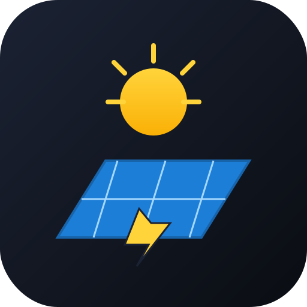

> 🇬🇧 English | [🇩🇪 Deutsch](README.de.md)

<p align="center">
  
</p>

# HMIP HCU Plugin: Sun2000 / FusionSolar

📦 **[Download hmip-hcu-fusionsolar-0.3.2.tar.gz](https://github.com/fabiorenner-hub/hmip-hcu-fusionsolar/releases/latest/download/hmip-hcu-fusionsolar-0.3.2.tar.gz)** — install via HCUweb → *Developer mode → Plugins → Install from file*.

GitHub: <https://github.com/fabiorenner-hub/hmip-hcu-fusionsolar>

A Homematic IP HCU plugin that reads (and where supported, controls) a Huawei
Sun2000 PV system locally via Modbus TCP, with optional FusionSolar cloud
fallback. Includes an extensive debug dashboard.

## Support

If this plugin is useful to you, please consider a small donation — it helps
me keep the lights on while building more HCU plugins:
[Donate via PayPal](https://www.paypal.com/donate/?hosted_button_id=JPZRATUUHRT5C).

## Install on your HCU

1. Download `hmip-hcu-fusionsolar-<version>.tar.gz` from the
   [Releases](https://github.com/fabiorenner-hub/hmip-hcu-fusionsolar/releases).
2. In HCUweb open *Developer mode → Plugins → Install from file* and upload it.
3. Configure the plugin and (optionally) open the local debug dashboard at
   `http://<hcu-ip>:8088`.

## Build it yourself

```powershell
./build.ps1   # Windows
```

```bash
chmod +x build.sh
./build.sh    # macOS / Linux
```

## What it does

- Modbus TCP polling of the Sun2000 inverter, LUNA2000 battery and DTSU666-H smart meter.
- Connect API integration: virtual `INVERTER`, `BATTERY`, `GRID_CONNECTION_POINT`, `ENERGY_METER` devices.
- Optional virtual SWITCH devices for battery forced-charge / forced-discharge.
- Optional FusionSolar cloud fallback (read-only).
- HCUweb config page with grouped properties.
- Local debug dashboard on port 8088 with live values, register browser, write-register tool, energy-flow diagram.

## Troubleshooting

Having trouble? Plugin connects to the dongle but reads time out, or values
stay at 0 W? Connection drops every 10 s with `socket closed by peer`?

→ See **[docs/TROUBLESHOOTING.md](docs/TROUBLESHOOTING.md)** for a structured
walkthrough (DE + EN), including dongle firmware bugs, the FusionSolar app
settings that matter, and how to escalate to Huawei support.

## Author

Issued by **Fabio Renner**.

### Third-party components

- [`modbus-serial`](https://github.com/yaacov/node-modbus-serial) by Yaacov Zamir and contributors — Modbus client for Node.js (ISC).
- [`express`](https://expressjs.com/) — HTTP server for the local debug dashboard (MIT).
- Sun2000, LUNA2000 and the FusionSolar cloud are products of Huawei Technologies; this plugin is not affiliated with or endorsed by Huawei. The DTSU666-H is a CHINT meter exposed via the Huawei smart-meter Modbus map.
- Built against the [Homematic IP Connect API 1.0.1](https://github.com/homematicip/connect-api) by eQ-3.

## License

Apache-2.0
